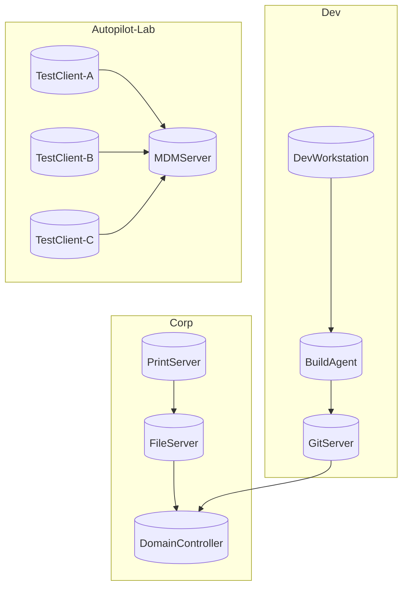

A few weeks ago I wrote about [HyperV.VMFactory](https://github.com/SasStu/HyperV.VMFactory) - a PowerShell module that wraps Hyper-V VM creation into a single well-structured cmdlet with sane defaults for Windows and Autopilot scenarios. Since then the module has grown quite a bit. Two sets of changes are worth writing up: a small quality-of-life addition to `New-HyperVVM`, and a much larger set of features that I've ported in from an older private module called PSHVTag - covering VM environment grouping, dependency-ordered start/stop, and Mermaid topology diagrams.

## A Small but Useful Addition: AutomaticCheckpointsEnabled

Hyper-V has a feature called Automatic Checkpoints. When enabled, Hyper-V takes a checkpoint automatically before each VM start. That sounds convenient, but in a lab context - especially Autopilot testing - it creates quiet storage bloat and can complicate the "delete and start fresh" workflow that differencing disks are designed for.

The module has always left automatic checkpoints off. The new change makes that explicit: `New-HyperVVM` and `New-HyperVVMConfiguration` both now have an `-AutomaticCheckpointsEnabled` switch. If you omit it (the default), automatic checkpoints stay disabled. If you deliberately want them, pass the switch:

```powershell
New-HyperVVM -VMName 'Dev-Server-01' -ParentDiskPath 'D:\BaseImages\Win11-24H2.vhdx' -VMSwitch 'LabSwitch' -AutomaticCheckpointsEnabled
```

For most lab use cases you won't need this. The point is that the module's behavior is now documented in the parameter list rather than being an implicit side-effect of the default.

## From Solo VMs to Environments: The PSHVTag Story

Running a lab with more than a handful of VMs quickly produces a new problem: not every VM is independent. A dev environment might need a Git server up before the build agent, which needs to be up before the dev workstations. An Autopilot test setup needs an MDM server running before any test client is enrolled. Starting and stopping these groups in the right order - and tracking which VMs belong together - used to be purely manual or scattered across ad-hoc scripts.

I solved that years ago with a private module called PSHVTag, which stored environment and dependency metadata in each VM's Notes field using XML tags. It worked, but XML in a Notes field is ugly, and the module lived outside the VM creation workflow. HyperV.VMFactory is the right home for this, so the functionality has been ported and modernised. The legacy XML format is still supported for migration.

The core idea is simple: a VM's Notes field carries a small JSON tag that records which environment it belongs to, which logical service it represents, and which other services it depends on. Everything else - topology discovery, ordered start/stop, diagram generation - is derived from those tags.

### Tagging VMs: Set-HyperVVMTag

Use `Set-HyperVVMTag` to attach environment and service metadata to a VM:

```powershell
# Tag the domain controller - no dependencies, it's the root service
Set-HyperVVMTag -VMName 'CORP-DC01' -EnvironmentName 'Corp' -ServiceName 'DomainController'

# Tag the file server - it depends on the domain controller being up first
Set-HyperVVMTag -VMName 'CORP-FS01' -EnvironmentName 'Corp' -ServiceName 'FileServer' -DependsOn 'DomainController'

# Tag the print server - it depends on the file server
Set-HyperVVMTag -VMName 'CORP-PRINT01' -EnvironmentName 'Corp' -ServiceName 'PrintServer' -DependsOn 'FileServer'
```

The tag is written as a `#HVTag:{...}` line appended to the VM's existing Notes field. Any notes you have already are preserved. A VM can belong to multiple environments or services if your topology calls for it.

For an Autopilot lab environment, you might tag things like this:

```powershell
Set-HyperVVMTag -VMName 'AP-MDM01'     -EnvironmentName 'Autopilot-Lab' -ServiceName 'MDMServer'
Set-HyperVVMTag -VMName 'AP-TEST-01'   -EnvironmentName 'Autopilot-Lab' -ServiceName 'TestClient-A' -DependsOn 'MDMServer'
Set-HyperVVMTag -VMName 'AP-TEST-02'   -EnvironmentName 'Autopilot-Lab' -ServiceName 'TestClient-B' -DependsOn 'MDMServer'
Set-HyperVVMTag -VMName 'AP-TEST-03'   -EnvironmentName 'Autopilot-Lab' -ServiceName 'TestClient-C' -DependsOn 'MDMServer'
```

### Exploring the Topology: Get-HyperVVMTopology

`Get-HyperVVMTopology` reads all tagged VMs on a host (or remote host) and returns a typed topology object. It resolves the services and their dependency order for each environment:

```powershell
$topology = Get-HyperVVMTopology
$topology.Environment | Select-Object Name, StartOrder
```

```
Name           StartOrder
----           ----------
Corp           {DomainController, FileServer, PrintServer}
Dev            {GitServer, BuildAgent, DevWorkstation}
Autopilot-Lab  {MDMServer, TestClient-A, TestClient-B, TestClient-C}
```

The topology object is the input accepted by most other cmdlets in this set. You can query it once and pipe or pass it around rather than having each cmdlet re-query the host.

### Starting and Stopping Environments: Start-HyperVVMEnvironment / Stop-HyperVVMEnvironment

`Start-HyperVVMEnvironment` starts all services in a named environment in topologically sorted order - dependencies first:

```powershell
Start-HyperVVMEnvironment -EnvironmentName 'Corp'
```

The module resolves the dependency graph, starts services in the right sequence, and can optionally wait for each VM's heartbeat before proceeding to the next:

```powershell
Start-HyperVVMEnvironment -EnvironmentName 'Corp' -WaitForVM -WaitTimeoutSeconds 120
```

`Stop-HyperVVMEnvironment` stops everything in reverse start order - dependents first, roots last:

```powershell
Stop-HyperVVMEnvironment -EnvironmentName 'Corp'
```

Both cmdlets accept a pre-built topology object (from `Get-HyperVVMTopology`) to avoid redundant host queries when managing multiple environments in sequence:

```powershell
$topology = Get-HyperVVMTopology
Stop-HyperVVMEnvironment -EnvironmentName 'Corp'          -Topology $topology
Stop-HyperVVMEnvironment -EnvironmentName 'Dev'           -Topology $topology
Stop-HyperVVMEnvironment -EnvironmentName 'Autopilot-Lab' -Topology $topology
```

### Service-Level Control: Start-HyperVVMService / Stop-HyperVVMService

Sometimes you want to start or stop a single service and have the module handle its dependencies automatically. `Start-HyperVVMService` does exactly that. Pass `-Recurse` and it will walk up the dependency chain, starting each dependency before the requested service:

```powershell
# Start BuildAgent - this will start GitServer first if it is not already running,
# because GitServer is listed as a dependency
Start-HyperVVMService -ServiceName 'BuildAgent' -EnvironmentName 'Dev' -Recurse -WaitForVM
```

`Stop-HyperVVMService` works the same way in reverse - stopping dependents before the named service.

### Visualising Your Lab: Get-HyperVVMMermaidDiagram

`Get-HyperVVMMermaidDiagram` generates a [Mermaid](https://mermaid.js.org/) `graph TD` diagram of your entire VM topology - environments as subgraphs, services as nodes, dependency edges as arrows:

```powershell
Get-HyperVVMMermaidDiagram | Set-Content 'topology.md'

# Or pass an existing topology object to skip a second host query
$topology | Get-HyperVVMMermaidDiagram -OutputPath 'topology.md'
```

For a lab with three environments - Corp, Dev, and Autopilot-Lab - the output would look like this:



Paste that into any Mermaid-capable renderer (the [Mermaid Live Editor](https://mermaid.live), VS Code with a Mermaid extension, or a GitHub markdown file) and you get a visual map of your lab topology - which is useful both for documentation and for quickly reasoning about start/stop order.

### Migrating from PSHVTag: Update-HyperVVMTag

If you used the older PSHVTag module (which stored environment and service data as XML tags inside VM Notes, e.g. `<Env>Corp</Env><Service>DomainController</Service>`), `Update-HyperVVMTag` will migrate your existing VMs to the new JSON format without you having to re-tag everything by hand:

```powershell
# Preview what would change
Get-VM | Update-HyperVVMTag -WhatIf

# Migrate all VMs on the local host
Get-VM | Update-HyperVVMTag
```

The old XML entries are stripped from the Notes field and replaced with a `#HVTag:{...}` JSON line. Any other content in the Notes field is preserved. Use `-Force` if a VM already has a new-format tag and you want to overwrite it.

## New Function Summary

Here's the full set of cmdlets added in this update:

| Cmdlet                       | What it does                                                                     |
| ---------------------------- | -------------------------------------------------------------------------------- |
| `Set-HyperVVMTag`            | Attaches environment, service, and dependency metadata to a VM's Notes field     |
| `Get-HyperVVMTag`            | Reads the HVTag from one or more VMs                                             |
| `Get-HyperVVMTopology`       | Builds a topology object from all tagged VMs on a host                           |
| `Start-HyperVVMEnvironment`  | Starts all services in an environment in dependency order                        |
| `Stop-HyperVVMEnvironment`   | Stops all services in an environment in reverse dependency order                 |
| `Start-HyperVVMService`      | Starts a named service, optionally resolving and starting its dependencies first |
| `Stop-HyperVVMService`       | Stops a named service, optionally stopping its dependents first                  |
| `Get-HyperVVMMermaidDiagram` | Generates a Mermaid diagram of the full VM topology                              |
| `Update-HyperVVMTag`         | Migrates legacy PSHVTag XML format to the new JSON-based HVTag format            |

The `New-HyperVVM` and `New-HyperVVMConfiguration` cmdlets from the original release are unchanged apart from the new `-AutomaticCheckpointsEnabled` switch.

## Get the Module

```powershell
Install-Module -Name HyperV.VMFactory
```

- **PowerShell Gallery**: [powershellgallery.com/packages/HyperV.VMFactory](https://www.powershellgallery.com/packages/HyperV.VMFactory)
- **GitHub**: [github.com/SasStu/HyperV.VMFactory](https://github.com/SasStu/HyperV.VMFactory)

As always, issues and PRs are welcome. If you've been using the old PSHVTag module and run into anything unexpected during migration, open an issue with your Notes field content and I'll take a look.
