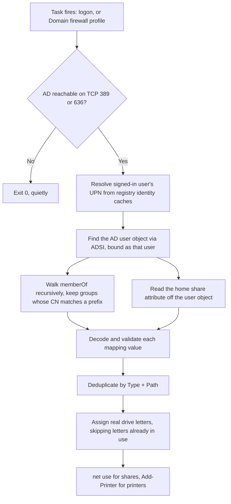

> Part 1 of 3 in the *Drive and printer mappings for Entra-joined devices* series.
> **Part 1 (this article)** - reading AD group data from a cloud-only device and acting on it.
> **Part 2** - running the job only when on-prem AD is actually reachable.
> **Part 3** - packaging and deploying the whole thing with PSAppDeployToolkit and Intune.

There is no shortage of drive- and printer-mapping scripts for cloud-only devices. I went looking before
writing any of this, and found plenty of them: mapping tables hardcoded in the script, JSON or CSV
manifests shipped inside the package, Intune remediation scripts with the share list sitting in a `switch`
block. All of them work. All of them keep the list of who-gets-what somewhere other than where that
decision is actually made.

What I did not find was one that asks Active Directory itself. So I wrote it, and this is that script.

You are moving to cloud-only devices - Entra-joined, managed by Intune, no on-prem domain join at all.
For most of the fleet that is a good move.

The files, though, often stay on-prem. Migrating file shares and print servers is its own project, usually
a slow one, and until it is done your users still need the shares and AD-connected printers those servers
provide. Cloud-only identity does not mean cloud-only resources.

That is where the pain shows up. Drive letters and printers used to arrive via Group Policy Preferences,
or on older estates a logon script. Either way the mechanism runs because a *domain* logon happened:
Group Policy is processed against a domain controller, and a logon script needs a `NETLOGON` share to run
from. On an Entra-joined device no domain logon ever happens. No DC to process policy against, no
`NETLOGON` share, no `USERDNSDOMAIN`. The user signs in, gets to the desktop, and `H:` is not there.

The file servers have not changed. They are still behind Active Directory, and access to them is still
governed by AD group membership. That directory is still the correct answer to "which shares should this
user have?" - the device just has no logon-shaped way to ask it any more.

This article is about asking it anyway.


*The starting point: `AzureAdJoined : YES`, `DomainJoined : NO`, and a device that has never heard of `H:`
or the print server.*

## Table of Contents

- [The Concept](#the-concept)
- [How the Script Works](#how-the-script-works)
- [Prerequisites](#prerequisites)
  - [Verify it, do not assume it](#verify-it-do-not-assume-it)
- [Deployment](#deployment)
  - [Step 1 - Prepare the AD groups](#step-1---prepare-the-ad-groups)
  - [Step 2 - Set the script parameters](#step-2---set-the-script-parameters)
  - [Step 3 - Run it as the signed-in user](#step-3---run-it-as-the-signed-in-user)
- [Getting the Script](#getting-the-script)
- [Things to Keep in Mind](#things-to-keep-in-mind)

## The Concept

The instinct is to put a mapping table in the script - a list of groups with their paths and drive
letters. Do not. You will be redeploying a script every time someone stands up a new share.

Instead, **the AD group carries its own mapping instructions**. A group that grants access to a share
also describes how to map it, in one of its own attributes. Membership is the entitlement; the group's
attribute is the configuration. The script contains no list of shares at all.

| Object | `cn` | Attribute | Mapping value | Result |
| --- | --- | --- | --- | --- |
| Share group | `GRP-SMB-Finance` | `info` | `\\fileserver01\finance;F` | `F:` → `\\fileserver01\finance` |
| Printer group | `GRP-PRT-HQ-Floor2` | `info` | `\\printserver01\HQ-Floor2-Colour` | Printer connection |
| User object | *(the user)* | `extensionAttribute3` | `\\fileserver01\home\jdoe` | `H:` → home share |

Adding a new share becomes an AD task, not a packaging task.

## How the Script Works



1. **Pre-flight AD.** A short-timeout TCP connect to port 389, then to 636 if 389 stays silent. If
   neither answers, exit 0 quietly - a laptop on a home network is not a failure, it is Tuesday.
2. **Resolve the signed-in user's UPN** from the local registry identity caches.
3. **Find the user object** in AD with a single ADSI query, binding as the signed-in user with no stored
   credentials.
4. **Walk `memberOf` recursively**, keeping groups whose `cn` starts with one of the configured prefixes,
   and following nested groups.
5. **Decode each matched group's mapping attribute** into a path and a requested drive letter, validating
   as it goes. A malformed value is skipped with a warning naming the group - never fatal to the run.
6. **Add the home share** from the user object as a special case, straight to a fixed letter.
7. **Deduplicate by type and path**, so the same share reached through two nested groups maps once.
8. **Assign real drive letters**, starting from the requested one and cycling forward if it is taken.
9. **Map them** - `net.exe use` for shares, `Add-Printer -ConnectionName` for printers - and transcript
   the whole run to a per-user log.

> **On resolving the UPN:** the obvious route is `whoami /upn`, but that spawns a child process from a
> scheduled task, which endpoint protection products treat as reconnaissance. The script reads the
> IdentityStore cache instead, keyed by the current user's SID, and only falls back to `whoami` if the
> registry sources are absent or do not match the current user.

## Prerequisites

The script binds to LDAP **with no credentials of its own**, as whoever is signed in. So the one thing
that has to be true is that Windows can turn the Entra sign-in into a credential a domain controller
accepts. How it does that depends on **how the user signed in** - and the common case needs nothing
deployed at all.

| Sign-in method | What you need |
| --- | --- |
| Username and password | Nothing extra. Hybrid users get this out of the box. |
| Windows Hello for Business, FIDO2 | Cloud Kerberos trust (or key trust, or certificate trust) |

On **password sign-in**, Entra ID returns the user's on-prem domain details alongside the Primary Refresh
Token, the LSA enables Kerberos and NTLM, and the device spends the password credential at a DC for a real
TGT. Microsoft documents this in
[How SSO to on-premises resources works on Microsoft Entra joined devices](https://learn.microsoft.com/entra/identity/devices/device-sso-to-on-premises-resources).
Note that this is Kerberos, not an NTLM fallback - you do not need to leave NTLM enabled for it.

On **passwordless sign-in** there is no password for the LSA to spend, which is exactly why Windows Hello
for Business needs a trust model to supply the on-prem credential instead. Prefer **cloud Kerberos trust**:
no PKI, no NDES, no certificate templates, just an Entra Kerberos server object published into your AD.
[Cloud Kerberos Trust - Part 1](https://msendpointmgr.com/2023/03/04/cloud-kerberos-trust-part-1/) on
msendpointmgr.com is a good walkthrough. Plan for this even if password sign-in works today - it is what
keeps this solution alive as you move to passwordless.

Beyond that: **hybrid identity** (users originate in on-prem AD and sync up via Entra Connect or Cloud
Sync - a cloud-only *user* has no on-prem account to find), and **line of sight to a domain controller**
at the moment the script runs, which is Part 2's entire subject.

### Verify it, do not assume it

Nothing in the code will tell you this is missing. The bind simply fails. Check before writing anything:

```powershell
klist
```

Look for a ticket for `krbtgt/CONTOSO.COM`. That is the honest check regardless of sign-in method. On the
cloud Kerberos trust path you can also use `dsregcmd /status` and look for `OnPremTgt : YES` under **SSO
State** - but do not use that on the password path, where it reads `NO` on a perfectly working device.

Better still, prove the actual thing:

```powershell
([ADSI]"LDAP://contoso.com").distinguishedName
```

If that returns `DC=contoso,DC=com`, you have an authenticated LDAP bind as the signed-in user from a
device that is not domain-joined. That is the entire foundation.


*The combination that makes this work: `DomainJoined : NO` on the left, `OnPremTgt : YES` on the right.
The device is not in the domain, but the signed-in user holds an on-prem TGT. This is a cloud Kerberos
trust device - on the password path `OnPremTgt` reads `NO` and you check `klist` instead.*

## Deployment

### Step 1 - Prepare the AD groups

This is where the actual configuration lives, so it is worth doing deliberately.

**Naming.** The prefix on the `cn` marks a group as "one of ours" and tells the script which kind of
mapping it is. Pick one prefix per type, matching your directory's convention:

| Type | Prefix | Example `cn` |
| --- | --- | --- |
| Printer | `GRP-PRT-` | `GRP-PRT-HQ-Floor2` |
| Share | `GRP-SMB-` | `GRP-SMB-Finance` |

The match is anchored to the start of the group's `cn`, not a substring search of the whole DN - so an OU
named `OU=GRP-SMB-Groups` will not accidentally pull in every group inside it.

**The mapping value.** Set the chosen attribute to `<UNC path><delimiter><drive letter>`:

```
\\fileserver01\finance;F
```

The first segment is the UNC path, the second the *requested* drive letter. Printers ignore the second
segment entirely - a mount point is meaningless for them, so `\\printserver01\HQ-Floor2-Colour` on its own
is the complete value.

> **Which attribute?** I use `info` (the "Notes" field on the Object tab in ADUC) rather than
> `description`, because `description` is usually already carrying human-readable text and gets edited by
> people who have no idea a script is parsing it. `info` is free-text and rarely claimed by anything else.

**The home share** is not a group entitlement - it belongs to one user, so it lives on the *user* object.
If your directory already populates AD's standard `homeDirectory`, use that; it is purpose-built and often
already filled in. Where it is unused or inconsistent, a spare `extensionAttribute` works just as well.
Having the value *is* the entitlement, and it goes to a fixed letter rather than a requested one.

> **The permissions trap.** Because the script binds as the signed-in user, every user can only see what
> their own account can see. If your directory restricts read access to `info` for ordinary users, the
> script will find the group, read nothing, and map nothing - silently, and correctly from its own point
> of view. **Test with a genuinely unprivileged account**, not your admin account, or you will ship
> something that works perfectly for exactly one person.


*The whole configuration, in two fields. The prefix on the group name tells the script which kind of
mapping this is, and the Notes field - the `info` attribute - carries the mapping value. A share group on
the left with its requested drive letter after the delimiter, a printer group on the right where that
second segment is ignored. The prefixes here are this lab's naming convention; use whatever yours is and
set `ADGroupPrefix` to match.*

### Step 2 - Set the script parameters

Everything is driven from the `param()` block at the top of the script. Nothing is hardcoded, so adapting
it to your environment is a matter of setting these rather than editing logic:

| Parameter | Default | What to set it to |
| --- | --- | --- |
| `ADGroupPrefix` | `@{ Printer = 'GRP-PRT-'; Share = 'GRP-SMB-' }` | Your two CN prefixes. Set either to `''` to skip that mapping type entirely. |
| `GroupMappingProperty` | `info` | The group attribute holding the mapping value. |
| `HomeShareMappingProperty` | `extensionAttribute3` | The *user* attribute holding the home share path. Use `homeDirectory` if you populate it. Leave empty to skip home shares. |
| `HomeShareMappingMountPoint` | `H` | Fixed drive letter for the home share. |
| `ADDelimiter` | `;` | Separator between path and drive letter. Change it if `;` appears in your paths. |
| `ADDomain` | - | Your AD DNS domain, e.g. `contoso.com`. The LDAP bind target and the pre-flight target. |
| `ADPort` | `389, 636` | Ports the pre-flight probes, in order. Trim it to one entry if your DCs only expose LDAP or only LDAPS to clients. |
| `LogfilePath` | `%LOCALAPPDATA%\MapPrinterAndShares\MapFromMWP.log` | Leave it. `LOCALAPPDATA` is already per-user, which is simpler than a shared `ProgramData` path plus permission changes. |

A worked example - printers only, `description` instead of `info`, no home share:

```powershell
.\MapDrivesAndPrinter.ps1 `
    -ADGroupPrefix @{ Printer = 'GRP-PRT-'; Share = '' } `
    -GroupMappingProperty 'description' `
    -HomeShareMappingProperty '' `
    -ADDomain 'contoso.com'
```

### Step 3 - Run it as the signed-in user

The script must run in the user's own session - it reads that user's registry hive and creates mappings
in their profile. Running it as SYSTEM will not work.

For a first test, just run it interactively on a device that passed the
[prerequisite check](#verify-it-do-not-assume-it) and read the transcript. Here is a full verbose run:


*Watch the order: the user object is found over LDAP, `memberOf` is walked recursively, then each mapping
is decoded and applied. Note what happens to the things that go wrong - two groups have an empty mapping
attribute, and one of the two printers does not exist. Each is logged as a warning and stepped over, and
the run still finishes with a drive and a printer on screen. A bad value in one group's attribute must
never cost a user their other mappings.*

In production it runs from a scheduled task as the Users group, at least privilege, which is Part 2.
Packaging and Intune deployment are Part 3.

## Getting the Script

The script and the Pester test suite covering its logic are in the
[SasStu/MapPrinterAndSharesCloudOnlyFromAD](https://github.com/SasStu/MapPrinterAndSharesCloudOnlyFromAD)
repository on GitHub.

## Things to Keep in Mind

**Mappings are additive.** Nothing is ever removed. A user who moves from Finance to Legal ends up holding
both drives. That is deliberate: converging to a desired state means knowing which mappings *we* created,
because the directory can only ever tell you which groups a user is **in**, never which ones they have
**left**. That needs provenance - a local record maintained across runs, kept correct when a user maps
something manually. It earns its keep only if stale mappings actually cause harm, and for drive letters
they mostly do not. The share ACL still says no. A stale `F:` after the user leaves Finance is a broken
shortcut, not a data leak.

**Drive letters collide with things that are not shares.** Letters in use are read from `Get-PSDrive`,
not `Get-SmbMapping`. A USB stick sitting on `H:` is not an SMB mapping but it will absolutely break your
home share. Because mappings are persistent, yesterday's letters are still there today - reasoning only
about the current run guarantees collisions.

**One bad group must not cost you the run.** A typo in one group's `info` value skips that mapping with a
warning naming the group's `cn`, and the rest still map. The person reading the log needs to know which
group to go fix.

**Log verbosely.** Nobody is watching this run. A transcript you did not need costs nothing; the
alternative is debugging a silent no-op over a support call. When `net.exe` fails, log its output
verbatim rather than matching on the message text - that text is localised and your parsing will break on
the first German-language device.

**It will fail at logon, almost every time.** The user signs in at home, the VPN is not up, no DC is
reachable - and the one moment you are guaranteed to execute is the one moment AD is guaranteed absent.
Solving that is Part 2: making a scheduled task run *when on-prem AD actually becomes reachable*,
using the Domain firewall profile as the signal and the Intune NetworkListManager CSP to earn that profile
on a device with no domain membership to earn it with.
