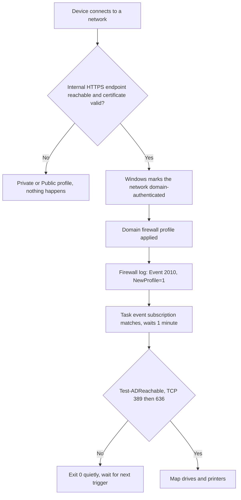

> Part 2 of 3 in the *Drive and printer mappings for Entra-joined devices* series.
> **Part 1** - reading AD group data from a cloud-only device and acting on it.
> **Part 2 (this article)** - running the job only when on-prem AD is actually reachable.
> **Part 3** - packaging and deploying the whole thing with PSAppDeployToolkit and Intune.

[Part 1](/posts/Part-1-Using-Active-Directory-Information-on-Cloud-Only-Devices-to-Map-Printers-and-Shares/) ended with a working script: given a cloud-only device whose signed-in user can authenticate
to on-prem AD, it discovers their group memberships and creates the matching drive and printer mappings.

Now it needs to run. The obvious trigger is logon - that is, after all, what the GPO or logon script it
replaces ran on. It is the worst possible choice.

Think about when a laptop actually signs in. The user opens the lid at home, or on a train, or in a hotel.
Wi-Fi associates somewhere around the time the credential provider appears. The VPN client has not
connected yet - on many setups it *cannot* connect until after sign-in, because it wants the user's
identity first. So at the exact moment the logon trigger fires, the device has no route to any domain
controller. The one moment we are guaranteed to run is the one moment AD is guaranteed to be absent.

An hour later the user connects the VPN or walks into the office, AD becomes reachable, and nothing
happens - the trigger fired long ago and the mappings are already "done".


*The logon trigger doing exactly what it promises: the task fires at 19:29:48, finds nothing answering on
389 or 636, and exits quietly twelve seconds later. Nothing is broken - the timing is simply wrong.*

## Table of Contents

- [The Concept](#the-concept)
- [How the Trigger Works](#how-the-trigger-works)
- [Prerequisites](#prerequisites)
- [Deployment](#deployment)
  - [Step 1 - Configure the NetworkListManager CSP in Intune](#step-1---configure-the-networklistmanager-csp-in-intune)
  - [Step 2 - Verify the Domain profile](#step-2---verify-the-domain-profile)
  - [Step 3 - Build the event subscription](#step-3---build-the-event-subscription)
  - [Step 4 - Configure the scheduled task](#step-4---configure-the-scheduled-task)
  - [Step 5 - Verify end to end](#step-5---verify-end-to-end)
- [The Complete Task Definition](#the-complete-task-definition)
- [Things to Keep in Mind](#things-to-keep-in-mind)

## The Concept

What we want to know is: *has this device just arrived somewhere that on-prem AD is plausibly reachable
from?*

Windows already tracks a version of that question and exposes the answer as the **firewall profile**. The
Domain profile is applied when Windows believes it is on the corporate network. That belief is normally
earned by domain membership - and a cloud-only device has none, so left alone it will classify the
corporate network as Private or Public forever.

So we grant it one. Since the Windows 11 **2302** release, Intune's Settings Catalog exposes the
**Network List Manager** CSP:

| Setting | What it does |
| --- | --- |
| `AllowedTlsAuthenticationEndpoints` | A list of internal HTTPS endpoints. When Windows reaches one *and* validates its TLS certificate, it marks the network domain-authenticated. |
| `ConfiguredTlsAuthenticationNetworkName` | An optional friendly name for the resulting network. |

Instead of proving it is on the corporate network by authenticating to a domain controller, the device
proves it by **validating the certificate of a server that only exists inside the corporate network**.
Windows switches to the Domain profile, and raises an event saying so. That event is our trigger.

## How the Trigger Works



1. **The device connects to a network** - office Ethernet, corporate Wi-Fi, or a VPN coming up.
2. **Windows tries the endpoints** named in the NetworkListManager policy, over HTTPS, and validates the
   certificate chain.
3. **On success it marks the network domain-authenticated** and applies the **Domain** firewall profile.
4. **Event 2010 is written** to the firewall operational log with a `NewProfile` value of `1`.
5. **The scheduled task's event subscription matches** that event, and only that event, then waits one
   minute before starting.
6. **The script pre-flights AD itself** with a short TCP connect to port 389, falling back to 636 if 389
   stays silent, because the Domain profile means Windows decided where it is, not that a DC is answering.
7. **If AD answers, it maps.** If not, it exits 0 and waits for the next trigger.

A logon trigger stays alongside the event trigger, for the office desktop that boots onto the corporate
network with AD already reachable. Two triggers, one action.

> **This is proof of network, not proof of service.** A successful validation tells you the device is
> sitting somewhere internal resources are reachable from. It does not tell you any particular domain
> controller is up, routable, or answering LDAP. Step 6 exists because of that gap.

## Prerequisites

Everything here rests on the endpoint you name in the CSP policy, which carries the entire security
property of the design. Choose it deliberately:

| Requirement | Why |
| --- | --- |
| HTTPS, with a chain the device trusts | Windows validates the certificate. Your internal PKI root, distributed via Intune, is the normal answer. |
| Resolvable and reachable **only from inside** | This is the actual proof. If the name resolves publicly and answers from anywhere, any coffee shop grants your fleet the Domain profile. |
| Boring and highly available | If it is down, devices do not get the Domain profile and mappings quietly stop appearing. Treat it as production infrastructure. |

Multiple endpoints are allowed - use more than one if a single host would be a fragile dependency.

Beyond the endpoint: **Windows 11 2302 or later** for the Settings Catalog to expose Network List
Manager, and everything from [Part 1](/posts/Part-1-Using-Active-Directory-Information-on-Cloud-Only-Devices-to-Map-Printers-and-Shares/) - hybrid identity, and a signed-in user who can authenticate to
on-prem AD.

**This is a hard prerequisite, not an optional extra.** Without the CSP policy deployed, a cloud-only
device never receives the Domain profile, the event below never fires, and the task silently degrades to
logon-only - with no error anywhere to explain why mappings stopped appearing. If you take one thing from
this article, take that sentence.

## Deployment

### Step 1 - Configure the NetworkListManager CSP in Intune

1. **Intune admin center** → *Devices* → *Configuration* → **Create** → *New policy*.
2. Platform **Windows 10 and later**, profile type **Settings catalog**.
3. Search the catalog for **Network List Manager**.
4. Add **Allowed Tls Authentication Endpoints** and enter your internal HTTPS endpoint(s), one per line,
   as full URLs: `https://intranet.contoso.com`.
5. Optionally add **Configured Tls Authentication Network Name** and give it a recognizable name - it is
   what users and your support team will see as the network's name.
6. Assign to your device group.


*The entire policy, in two settings. The endpoint list is the part that carries the security property -
the network name is only what your users and your support desk will see.*

If you would rather not click through the catalog, the finished profile is in the repository as
[Intune/CProf-Win-D-SetCat-FirewallDomainProfile-[ToEdit].json](https://github.com/SasStu/MapPrinterAndSharesCloudOnlyFromAD/blob/main/Intune/CProf-Win-D-SetCat-FirewallDomainProfile-%5BToEdit%5D.json)
and the admin center imports it directly: *Devices* → *Manage devices* → *Configuration* → **Create** →
**Import policy**, select the file, give the new policy a name, and save. That gets you both settings with
the correct `settingDefinitionId` values without hunting through the catalog.

The `[ToEdit]` in the name is the important part. Both values in the export are placeholders: it ships with
`https://internalwebsite/` as the endpoint and `Dummy` as the network name. Replace them with your own
before the policy goes anywhere near a device group. The export carries no assignments either, so step 6
is still yours to do after the import.

### Step 2 - Verify the Domain profile

On a target device, connected to the corporate network:

```powershell
Get-NetConnectionProfile
```

`NetworkCategory` should read **DomainAuthenticated**. If it says `Private` or `Public`, the policy has
not applied, the endpoint is not reachable, or its certificate did not validate - check in that order. The
firewall's own view:

```powershell
Get-NetFirewallProfile -Name Domain | Select-Object Name, Enabled
netsh advfirewall show currentprofile
```

Do not continue until this reads `DomainAuthenticated`. Everything downstream depends on it.


*The combination this whole article is built on: `DomainAuthenticated` with `DomainAuthenticationKind :
Tls` on the left, `DomainJoined : NO` on the right. The Domain profile on a device that never joined a
domain.*

### Step 3 - Build the event subscription

The profile change lands in `Microsoft-Windows-Windows Firewall With Advanced Security/Firewall` as
**Event ID 2010**, carrying a `NewProfile` field. That field is the `NET_FW_PROFILE2` bitmask:

| Value | Profile |
| --- | --- |
| `1` | Domain |
| `2` | Private |
| `4` | Public |

We want `1`, and only `1`. Every network change raises a 2010 - joining hotel Wi-Fi raises one with
`NewProfile=4`. Subscribing without filtering means running the script every time anybody changes
network, which is the polling behavior we are avoiding.

```xml
<QueryList>
  <Query Id="0" Path="Microsoft-Windows-Windows Firewall With Advanced Security/Firewall">
    <Select Path="Microsoft-Windows-Windows Firewall With Advanced Security/Firewall">
      *[System[(Level=4 or Level=0) and (EventID=2010)]]
      and
      *[EventData[Data[@Name='NewProfile'] and (Data='1')]]
    </Select>
  </Query>
</QueryList>
```

Test the filter before wiring it to anything: paste it into Event Viewer's *Filter Current Log* → *XML*
tab, disconnect and reconnect the corporate network, and confirm exactly one event appears.


*Public to Domain, in plain language. This is the moment the task has been waiting for.*

The General tab renders the profile by name; the Details tab shows the raw `EventData` the subscription
actually filters on - `NewProfile` as the bitmask value `1`:


*The same event, as the subscription sees it: `OldProfile` 4 and `NewProfile` 1. Those are the raw values
the filter in Step 3 matches on - not the friendly names above.*

### Step 4 - Configure the scheduled task

Two triggers. The event subscription from Step 3, plus logon:

```xml
<Triggers>
  <EventTrigger>
    <Enabled>true</Enabled>
    <Subscription><!-- the QueryList above, XML-escaped --></Subscription>
    <Delay>PT1M</Delay>
  </EventTrigger>
  <LogonTrigger>
    <Enabled>true</Enabled>
  </LogonTrigger>
</Triggers>
```

The principal, the action, and the settings that matter:

| Setting | Value | Why |
| --- | --- | --- |
| `GroupId` | `S-1-5-32-545` | The built-in **Users** group. The task runs in each signed-in user's own session, as that user - the whole premise from [Part 1](/posts/Part-1-Using-Active-Directory-Information-on-Cloud-Only-Devices-to-Map-Printers-and-Shares/). The well-known SID rather than the name keeps the XML working on non-English Windows. |
| `RunLevel` | `LeastPrivilege` | There is no elevation anywhere in this design, and it does not need any. |
| `Delay` on the event trigger | `PT1M` | The Domain profile means Windows decided where it is, not that DNS settled or routes are final. A minute converts most "AD was not quite up yet" failures into successes, at a cost nobody notices. |
| `DisallowStartIfOnBatteries` | `false` | **Must** be false. The default is `true`, and this is a laptop fleet - the default would skip precisely the devices this exists for. |
| `StopIfGoingOnBatteries` | `false` | Same reason. |
| `MultipleInstancesPolicy` | `IgnoreNew` | Prevents pile-ups on rapid network flapping. See the note below about stuck instances. |
| `ExecutionTimeLimit` | `PT1H` | Backstop. |
| `AllowStartOnDemand` | `true` | Lets a user or your support desk trigger a re-map manually - Part 3 turns this into a Start Menu shortcut. |
| `Hidden` | `true` | Keeps it out of the default Task Scheduler view. |

The action:

```xml
<Actions Context="Author">
  <Exec>
    <Command>C:\Windows\System32\conhost.exe</Command>
    <Arguments>--headless powershell.exe -ex bypass -File "C:\Program Files\MapDrivesAndPrinter\MapDrivesAndPrinter.ps1"</Arguments>
    <WorkingDirectory>C:\windows\System32</WorkingDirectory>
  </Exec>
</Actions>
```

The `conhost.exe --headless` wrapper is not decoration. Launching `powershell.exe` directly from a task in
the user's session flashes a console window on screen - every logon, every network change. `conhost
--headless` runs it with no visible window at all.

> If you export this from Task Scheduler by hand, note the export is **UTF-16** encoded. Preserve that if
> you edit the file - writing it back as UTF-8 produces an XML file Task Scheduler refuses to import, with
> an unhelpful error.

### Step 5 - Verify end to end

Disconnect from the corporate network, reconnect, and watch the chain: `Get-NetConnectionProfile` flips to
`DomainAuthenticated`, a 2010 with `NewProfile=1` appears in the firewall log, the task's **History** tab
shows a run about a minute later, and the script's transcript at
`%LOCALAPPDATA%\MapPrinterAndShares\MapFromMWP.log` shows the mappings. If any link is missing, that is
the one to investigate - each step above verifies exactly one of them.

## The Complete Task Definition

The task XML, the script, the Pester test suite, and the exported Intune profile from Step 1 are on
[SasStu/MapPrinterAndSharesCloudOnlyFromAD](https://github.com/SasStu/MapPrinterAndSharesCloudOnlyFromAD):

| Path | What it is |
| --- | --- |
| [`Install/SMBShares.xml`](https://github.com/SasStu/MapPrinterAndSharesCloudOnlyFromAD/blob/main/Install/SMBShares.xml) | The complete scheduled task definition, both triggers included. |
| [`Intune/`](https://github.com/SasStu/MapPrinterAndSharesCloudOnlyFromAD/tree/main/Intune) | The Network List Manager profile from Step 1, ready for **Create** → **Import policy**. Replace the placeholder values. |
| [`Script/`](https://github.com/SasStu/MapPrinterAndSharesCloudOnlyFromAD/tree/main/Script) | `MapDrivesAndPrinter.ps1`, the script from Part 1. |
| [`Tests/`](https://github.com/SasStu/MapPrinterAndSharesCloudOnlyFromAD/tree/main/Tests) | The Pester suite. |

## Things to Keep in Mind

**Do not poll.** A timer trigger every fifteen minutes will eventually catch the network coming up, and it
will do so by waking a fleet of laptops all day to check for an event that happens once or twice per
device. Across a few thousand machines that is a real battery cost and a real support ticket about
battery. Polling is what you write when you have no event.

**Do not trust the trigger.** The script pre-flights AD itself, with a two-second TCP connect to port 389
and then to 636, and exits `0` when neither answers:

```powershell
if (-not (Test-ADReachable -ADDomain $ADDomain -Port $ADPort)) {
    Write-Verbose "Active Directory ($ADDomain) is not reachable on $($ADPort -join ', '); exiting quietly."
    Stop-Transcript
    exit 0
}
```

`$ADPort` defaults to `389, 636` and the ports are tried in order, so the probe answers the question that
actually matters - is *a* domain controller listening for LDAP from here - rather than assuming plain
LDAP is exposed to clients. Environments that have closed 389 in favor of LDAPS still pass the pre-flight.
The two-second budget is per port, so the worst case on a network where nothing answers is four seconds
before the quiet exit.

**Exit `0`, not an error.** "AD is not reachable right now" is the expected state for most of the day on a
laptop. Exiting non-zero would fill your Intune and event logs with red that means nothing, and train
everyone to ignore it. The correct behavior on an untrusted network is to do nothing, quietly.

**A hang is not a slow success.** `MultipleInstancesPolicy=IgnoreNew` plus a one-hour `ExecutionTimeLimit`
means **one stuck instance swallows every trigger for an hour**. That is the direct reason the script sets
`ClientTimeout` on its `DirectorySearcher` and pre-flights with a short timeout, rather than letting an
LDAP call hang until Windows loses patience.

**Keep the logon trigger.** A desktop in the office that never leaves the corporate network signs in with
AD already reachable, and for that machine logon is exactly right. It is one trigger among two, not the
mechanism.

**You still cannot deploy any of this.** You have a script that does the right thing and a trigger that
fires at the right moment, but no way to get either onto a few thousand machines. Part 3 covers
packaging it with PSAppDeployToolkit v4, deploying through Intune, giving users a Start Menu shortcut to
re-run on demand, and where to look when one device misbehaves.
