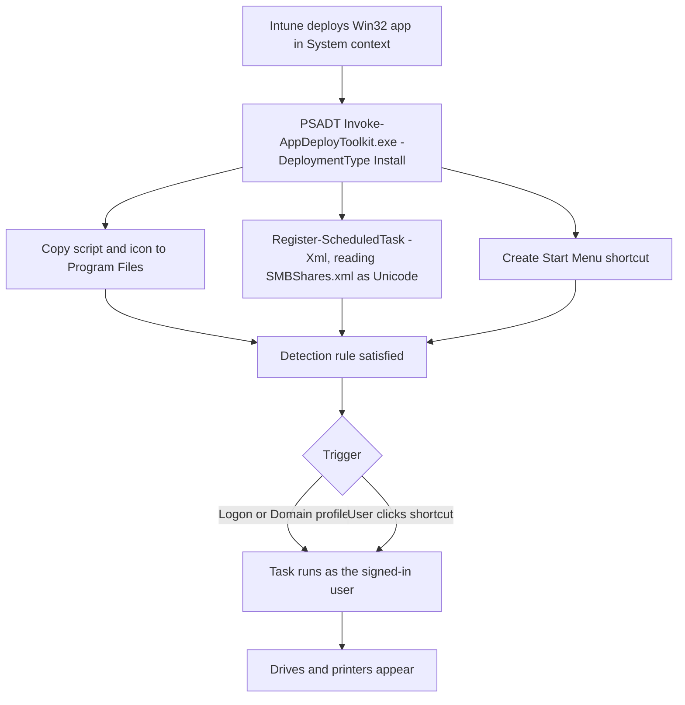

> Part 3 of 3 in the *Drive and printer mappings for Entra-joined devices* series.
> **[Part 1](/posts/Part-1-Using-Active-Directory-Information-on-Cloud-Only-Devices-to-Map-Printers-and-Shares/)** - reading AD group data from a cloud-only device and acting on it.
> **[Part 2](/posts/Part-2-Running-a-Scheduled-Task-Only-When-Active-Directory-Is-Actually-Reachable/)** - running the job only when on-prem AD is actually reachable.
> **Part 3 (this article)** - packaging and deploying it with PSAppDeployToolkit and Intune.

By the end of [Part 1](/posts/Part-1-Using-Active-Directory-Information-on-Cloud-Only-Devices-to-Map-Printers-and-Shares/) we had a script that discovers a user's AD group memberships from a cloud-only
device and maps their drives and printers. By the end of [Part 2](/posts/Part-2-Running-a-Scheduled-Task-Only-When-Active-Directory-Is-Actually-Reachable/) we had a scheduled task that runs it
at the moment on-prem AD actually becomes reachable, driven by the Domain firewall profile that the
NetworkListManager CSP grants.

Two artefacts, then, that need to land on every device - the script and the task definition. Plus one
thing users will ask for the moment they understand what this does: **a way to re-run it now**, without
waiting for a logon or a network change. Group membership changes mid-morning; the user should not have
to reboot to see the new drive.

This part wraps all three into a PSAppDeployToolkit package, pushes it through Intune as a Win32 app, and
covers where to look when one device is not behaving.


## Table of Contents

- [The Concept](#the-concept)
- [How the Package Works](#how-the-package-works)
- [Prerequisites](#prerequisites)
- [Deployment](#deployment)
  - [Step 1 - Assemble the package](#step-1---assemble-the-package)
  - [Step 2 - Write the install logic](#step-2---write-the-install-logic)
  - [Step 3 - Write the uninstall logic](#step-3---write-the-uninstall-logic)
  - [Step 4 - Wrap it for Intune](#step-4---wrap-it-for-intune)
  - [Step 5 - Create the Win32 app](#step-5---create-the-win32-app)
  - [Step 6 - Expect nothing to happen immediately](#step-6---expect-nothing-to-happen-immediately)
- [When a Device Misbehaves](#when-a-device-misbehaves)
- [The Complete Package](#the-complete-package)
- [Things to Keep in Mind](#things-to-keep-in-mind)
- [Wrapping Up](#wrapping-up)

## The Concept

One package installs three things, and nothing else:

| Artefact | Destination | Purpose |
| --- | --- | --- |
| `MapDrivesAndPrinter.ps1` | `C:\Program Files\MapDrivesAndPrinter\` | The script from Part 1 |
| `SMBShares.xml` | Registered with Task Scheduler | The task from Part 2, imported verbatim |
| `Remap Drives and Printer.lnk` | Common Start Menu | On-demand re-run |

The design rule that keeps this simple: **the task XML is imported exactly as Task Scheduler exported
it**. `Register-ScheduledTask -Xml` takes the definition as-is. The alternative - rebuilding the task from
`New-ScheduledTaskTrigger` and friends - means re-expressing the event subscription XPath, the principal
SID, and every setting from [Part 2](/posts/Part-2-Running-a-Scheduled-Task-Only-When-Active-Directory-Is-Actually-Reachable/) in a second, subtly different dialect. One source of truth is
better than two that agree on a good day.

## How the Package Works



1. **Intune installs the Win32 app in System context** - required, because the install writes to
   `Program Files` and registers a scheduled task.
2. **PSADT runs the Install phase**, which copies the script and its icon into the install directory.
3. **The task XML is read as Unicode and registered** with `-Force`, so a reinstall replaces cleanly.
4. **The Start Menu shortcut is created**, pointing at the same command the task itself runs.
5. **Intune's detection rule** confirms the install.
6. **From then on the task drives itself** - the triggers from Part 2, or the user clicking the shortcut.

Note what step 6 does *not* include: the installer never runs the script. Intune installs run as SYSTEM,
frequently between user sessions, and the script is explicitly a per-user operation binding as the signed-in
user. Running it as SYSTEM would resolve no UPN and map nothing.

## Prerequisites

| Requirement | Notes |
| --- | --- |
| PSAppDeployToolkit v4 template | `PSAppDeployToolkit_Template_v4.zip` from the [releases page](https://github.com/PSAppDeployToolkit/PSAppDeployToolkit/releases). This package was authored against **4.1.8**. |
| Microsoft Win32 Content Prep Tool | [IntuneWinAppUtil](https://github.com/microsoft/Microsoft-Win32-Content-Prep-Tool), to produce the `.intunewin` |
| Everything from Parts 1 and 2 | Hybrid identity, a user who can authenticate to on-prem AD, and the NetworkListManager CSP policy |

**Why PSADT at all?** You could do this with a bare PowerShell script wrapped as a Win32 app, and for
something this small that is defensible. I used [PSAppDeployToolkit v4](https://psappdeploytoolkit.com)
for boring reasons that pay off in month six rather than on day one: consistent logging in a known
location and format, a real uninstall path rather than an afterthought, structured
install/uninstall/repair phases, and the same shape as every other package in the estate. When a device
misbehaves at 4pm on a Friday, "the logs are where the logs always are" is worth more than the elegance of
any individual package. If your fleet does not already use PSADT, weigh it - the toolkit is a ~9 MB
dependency to carry for a single script.

**Assign this package to the same devices that receive the NetworkListManager policy.** A device with the
package and without that policy installs perfectly and then does nothing on any schedule but logon.

## Deployment

### Step 1 - Assemble the package

A v4 template with the two artefacts dropped in:

```
Install\
├── Invoke-AppDeployToolkit.ps1     ← our deployment logic
├── Invoke-AppDeployToolkit.exe     ← PSADT launcher, from the template
├── SMBShares.xml                   ← the scheduled task definition from Part 2
├── PSAppDeployToolkit\             ← the PSADT module, from the template
└── Files\
    ├── MapDrivesAndPrinter.ps1     ← the script from Part 1
    └── mapshares-printer.ico       ← icon for the Start Menu shortcut
```

### Step 2 - Write the install logic

All of it, in one function:

```powershell
function Install-MapDrivesAndPrinterTask
{
    $installDir = "$envProgramFiles\MapDrivesAndPrinter"
    New-ADTFolder -LiteralPath $installDir
    Copy-ADTFile -Path "$($adtSession.DirFiles)\MapDrivesAndPrinter.ps1" -Destination "$installDir\MapDrivesAndPrinter.ps1"
    Copy-ADTFile -Path "$($adtSession.DirFiles)\mapshares-printer.ico" -Destination "$installDir\mapshares-printer.ico"

    $taskXml = Get-Content -LiteralPath "$PSScriptRoot\SMBShares.xml" -Raw -Encoding Unicode
    Register-ScheduledTask -TaskName 'MapDrivesAndPrinter' -Xml $taskXml -Force | Out-Null

    New-ADTShortcut -LiteralPath "$envCommonStartMenuPrograms\Remap Drives and Printer.lnk" `
        -TargetPath "$envWinDir\System32\conhost.exe" `
        -Arguments "--headless powershell.exe -ex bypass -File `"$installDir\MapDrivesAndPrinter.ps1`"" `
        -IconLocation "$installDir\mapshares-printer.ico" `
        -Description 'Re-run the drive and printer mapping task now, without waiting for logon or a network change.' `
        -WorkingDirectory "$envWinDir\System32"
}
```

Three details that are easy to get wrong:

| Detail | Why it matters |
| --- | --- |
| `-Encoding Unicode` on the XML read | The Task Scheduler export is UTF-16. Reading it as UTF-8 produces garbage that `Register-ScheduledTask` rejects. |
| Icon copied to the **install directory**, not referenced in `Files\` | A shortcut's icon path is evaluated whenever the shortcut is drawn - long after Intune's temp folder is gone. Point it at `Files\` and you get a working shortcut with a blank icon a few minutes later. |
| Every step idempotent | `Copy-ADTFile` overwrites, `Register-ScheduledTask -Force` replaces, `New-ADTShortcut` recreates. That makes the Repair phase a straight re-run of Install. |


### Step 3 - Write the uninstall logic

```powershell
function Uninstall-MapDrivesAndPrinterTask
{
    Unregister-ScheduledTask -TaskName 'MapDrivesAndPrinter' -Confirm:$false -ErrorAction SilentlyContinue
    Remove-ADTFile -Path "$envCommonStartMenuPrograms\Remap Drives and Printer.lnk"
    Remove-ADTFolder -Path "$envProgramFiles\MapDrivesAndPrinter"
}
```

The task, the shortcut, the install folder. **Not the mappings** - see Things to Keep in Mind.

### Step 4 - Wrap it for Intune

```powershell
IntuneWinAppUtil.exe -c .\Install -s Invoke-AppDeployToolkit.exe -o .\Output
```

### Step 5 - Create the Win32 app

| Field | Value |
| --- | --- |
| Install command | `Invoke-AppDeployToolkit.exe -DeploymentType Install -DeployMode Silent` |
| Uninstall command | `Invoke-AppDeployToolkit.exe -DeploymentType Uninstall -DeployMode Silent` |
| Install behaviour | **System** |
| Device restart behaviour | No specific action |

System context is required for the install. That the *task* subsequently runs as the signed-in user is
unrelated - that is the task's own principal, set in the XML from Part 2.

For **detection**, the simplest reliable option is file-based: rule type **File**, path
`C:\Program Files\MapDrivesAndPrinter`, file `MapDrivesAndPrinter.ps1`, method **File or folder exists**.
If you version the script, switch to version-based detection so upgrades are detected properly. A tidier
alternative checks the state you actually care about:

```powershell
if (Get-ScheduledTask -TaskName 'MapDrivesAndPrinter' -ErrorAction SilentlyContinue) {
    Write-Output 'Installed'
    exit 0
}
exit 1
```

### Step 6 - Expect nothing to happen immediately

There is no first-run handling, and that is deliberate rather than missing. After install, mappings appear
at the **next logon or the next transition to the Domain profile**. On a device already sitting on the
corporate network that is typically minutes away - or immediately, if the user clicks the Start Menu
shortcut. Put this in your deployment notes so nobody reports it as a bug.

## When a Device Misbehaves

Four places, in order:

1. **The script's transcript** - `%LOCALAPPDATA%\MapPrinterAndShares\MapFromMWP.log`. Per-user, verbose,
   rotated three generations deep. This is the first place to look and usually the last: it names the
   resolved UPN, every group matched, every mapping request, and every skipped mapping with a reason.
   Note it is **per user** - if you are in the wrong profile you will find nothing.
2. **The PSADT install log** - `C:\Windows\Logs\Software\`. Install-time problems only: file copy
   failures, task registration failures.
3. **The task's History tab.** This tells you whether the task **fired**, which is a different question
   from whether the script **worked**. Empty history after a network change means the problem is upstream.
4. **The firewall event log** - Event ID 2010. No 2010 with `NewProfile=1` means the device never reached
   the Domain profile, so the NetworkListManager policy or its endpoint is what to investigate. See
   [Part 2](/posts/Part-2-Running-a-Scheduled-Task-Only-When-Active-Directory-Is-Actually-Reachable/).

| Symptom | Cause |
| --- | --- |
| Task never fires on network change | NetworkListManager policy not applied, endpoint unreachable, or its certificate does not validate. `Get-NetConnectionProfile` will not say `DomainAuthenticated`. |
| Task fires, log says "not reachable", exits 0 | Working as designed. Domain profile arrived but no DC answered on 389 or 636 - VPN split-tunnel, firewall, or DC genuinely down. |
| Log says "UserUPN not found" | Registry identity caches absent or belong to a different account, and `whoami /upn` also failed. Check `dsregcmd /status`. |
| Runs cleanly, maps nothing | The user's groups do not match your prefixes, **or** the user cannot read the mapping attribute. Test with a genuinely unprivileged account - see [Part 1](/posts/Part-1-Using-Active-Directory-Information-on-Cloud-Only-Devices-to-Map-Printers-and-Shares/). |
| One share missing, others fine | Malformed value in that group's attribute. The log names the group's `cn`. |
| Drive lands on the wrong letter | Requested letter already in use on the device. By design - it cycles forward rather than failing. |

## The Complete Package

The script, the Pester test suite covering its logic, the task definition, and the PSADT package are on
[SasStu/MapPrinterAndSharesCloudOnlyFromAD](https://github.com/SasStu/MapPrinterAndSharesCloudOnlyFromAD).

## Things to Keep in Mind

**Verify the two invisible prerequisites first**, on one device, by hand. Both are invisible to the code
and neither produces a useful error when missing. Almost every "it does not work" report on this design is
one of these two:

1. **The user can authenticate to on-prem AD.** `klist` showing a `krbtgt/<your domain>` ticket is the
   check that works regardless of how they signed in. (`dsregcmd /status` → `OnPremTgt : YES` also
   confirms it, but only on the Windows Hello / cloud Kerberos trust path - on password sign-in it reads
   `NO` on a perfectly working device. See [Part 1](/posts/Part-1-Using-Active-Directory-Information-on-Cloud-Only-Devices-to-Map-Printers-and-Shares/).)
2. **The device is on the Domain profile.** `Get-NetConnectionProfile` showing `DomainAuthenticated`.

**Uninstall deliberately leaves the mappings behind.** That follows directly from the additive design in
[Part 1](/posts/Part-1-Using-Active-Directory-Information-on-Cloud-Only-Devices-to-Map-Printers-and-Shares/): this tool never removes a mapping, and uninstalling it is not a special case. The mappings it
created are ordinary persistent drive mappings and printer connections that now belong to the user.
Removing them at uninstall would mean the tool *does* track provenance after all, and would make an
uninstall/reinstall cycle destructive for anyone whose drives are currently working. If you want them
gone, that is a separate, deliberate cleanup action.

**Test with an unprivileged account.** The whole design binds as the user. Your admin account is not
representative of anything.

**Accept that mappings are additive**, or plan for the alternative deliberately. Stale drive letters
accumulate. The ACLs still hold, so it is untidiness rather than exposure - but untidiness that compounds
over years.

**Keep the config in the directory.** The moment you start putting share paths in the script, you have
recreated the GPO or logon script you were replacing, with worse deployment ergonomics. If a new share
means editing a repository, something has gone wrong.

## Wrapping Up

Three parts, and the shape of the thing is: the directory still holds the truth, the device just needs a
way to ask that does not depend on a domain logon, and a way to know when asking is worth the attempt.

Neither prerequisite ships in the repository, because neither is code - identity is an identity decision
and the NetworkListManager CSP is a network one. What is in the repository is the part that sits between
them.
