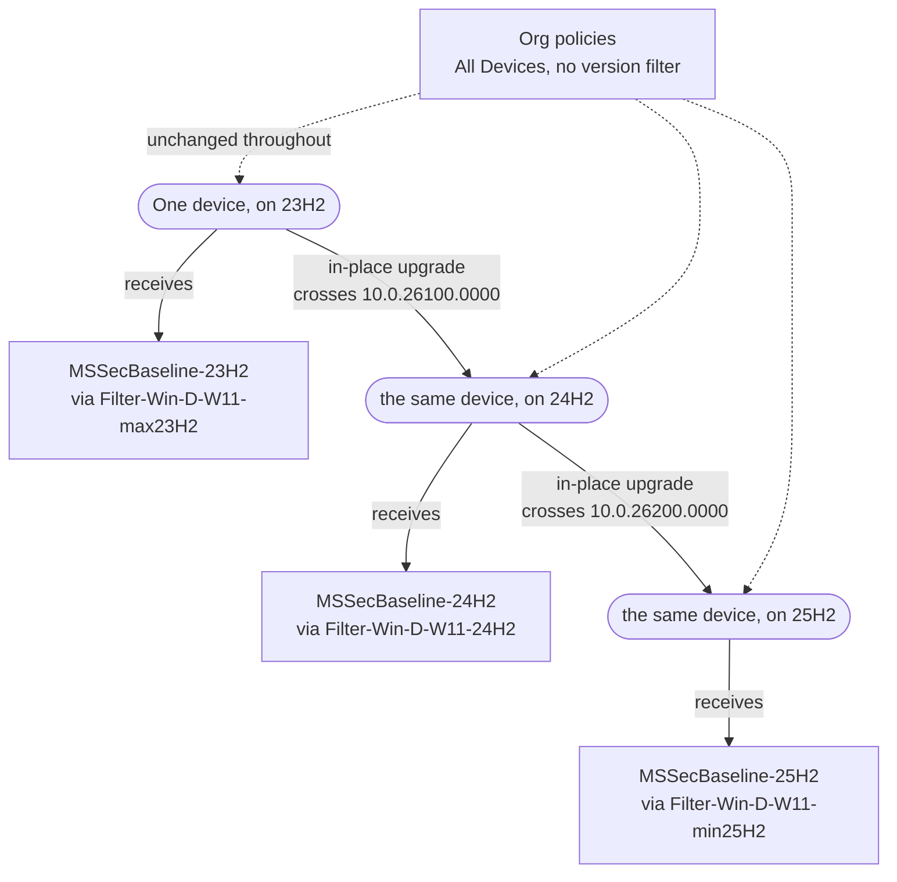

_Microsoft deprecated the `osVersion` filter property. That sent me through every assignment filter in my tenant, and it turned out the ones doing real work were all doing the same single thing._

## Table of Contents

- [Table of Contents](#table-of-contents)
- [The Deprecation That Started This](#the-deprecation-that-started-this)
- [What I Use OS Version Filters For](#what-i-use-os-version-filters-for)
- [The Boundary Rule](#the-boundary-rule)
- [Naming the Filters](#naming-the-filters)
- [Floor-Based Profiles: A Feature That Needs a Minimum Version](#floor-based-profiles-a-feature-that-needs-a-minimum-version)
- [Security Baselines: One Set Per Release](#security-baselines-one-set-per-release)
- [This Is Not a New Problem](#this-is-not-a-new-problem)
- [Bands, With Both Ends Open](#bands-with-both-ends-open)
- [Handling Deviations From the Baseline](#handling-deviations-from-the-baseline)
  - [Removal, not precedence](#removal-not-precedence)
  - [What removal buys back](#what-removal-buys-back)
- [The Rollout Choreography](#the-rollout-choreography)
- [Pitfalls](#pitfalls)
- [Closing](#closing)

---

## The Deprecation That Started This

Microsoft's [assignment filter reference](https://learn.microsoft.com/intune/intune-service/fundamentals/filters-device-properties) now carries this note against the `osVersion` property:

> The `osVersion` property is deprecated. Use the `operatingSystemVersion` property instead. You can't create new assignment filters that use `osVersion`. Existing assignment filters that use `osVersion` continue to work.

Nothing breaks, which is exactly why it is worth looking at rather than ignoring. Existing filters keep running, so a tenant that has been going a few years will quietly carry `osVersion` rules until someone goes looking.

The two properties are not equivalent, and that is the real point. `osVersion` only ever did string matching: `-eq`, `-in`, `-startsWith`, `-contains`. `operatingSystemVersion` adds the version comparison operators, `-gt`, `-lt`, `-ge` and `-le`. A rule that said `-startsWith "10.0.26100"` was matching text that happened to look like a version. A rule that says `-ge 10.0.26100.0000` is comparing versions.

Rewriting mine was a small job. Noticing what they were all for was the interesting part.

---

## What I Use OS Version Filters For

Two jobs, and in my tenant they are the only two.

**A feature that needs a minimum version.** A setting exists from a certain release onward and not before. Windows LAPS Automatic Account Management is the example I keep coming back to. There is one boundary, it never moves, and devices cross it by upgrading.

**Security baselines.** Microsoft revises its recommendations with every Windows release, and I keep one complete set of those settings per OS generation. Here the decision does not happen once. It repeats at every release, which needs a different shape.

The first needs a floor. The second needs a series of bands. Both are built from the same rule, so that comes first.

---

## The Boundary Rule

| Release         | Build                   | Boundary value    |
| --------------- | ----------------------- | ----------------- |
| Windows 11 23H2 | 10.0.22631              | `10.0.22631.0000` |
| Windows 11 24H2 | 10.0.26100              | `10.0.26100.0000` |
| Windows 11 25H2 | 10.0.26200              | `10.0.26200.0000` |
| Windows 11 26H2 | 10.0.26300              | `10.0.26300.0000` |

Intune reports the OS version as a four-part value, for example `10.0.26100.4652`. The first three parts identify the release. The fourth is the patch level and changes every month, so any rule you write has to be correct for every possible fourth part. That is what the `.0000` in the boundary column is for: it sits below every real patch level of its release, including RTM, so nothing on that release can fall underneath it.

The whole technique then fits in one line:

> **One boundary value, used twice: `-ge` above it, `-lt` below it.**

```text
(device.operatingSystemVersion -ge 10.0.26100.0000)    all of 24H2 and newer
(device.operatingSystemVersion -lt 10.0.26100.0000)    everything older
```

Same number on both sides, inclusive `-ge` on one and exclusive `-lt` on the other. The two sets cannot overlap and cannot leave a gap. Every device lands in exactly one.

That property is what you are protecting. Mixing `-gt` with `-le`, or using two nearby but different numbers, breaks it silently. Nothing errors. Devices just quietly stop matching.

---

## Naming the Filters

Filters are referenced by name in every assignment blade, so the name has to say which shape it is without being opened.

```text
Filter-<OS>-<D(evice)|U(ser)>-<Purpose>
```

| Filter name                | Rule shape            |
| -------------------------- | --------------------- |
| `Filter-Win-D-W11-max23H2` | Ceiling, below 24H2   |
| `Filter-Win-D-W11-24H2`    | Band, 24H2 only       |
| `Filter-Win-D-W11-min24H2` | Floor, 24H2 and newer |

The `min` and `max` prefixes are doing the work. `24H2` and `min24H2` differ only in whether they are closed at the top, and they are not interchangeable. Pick one set of prefixes and hold to it.

**A note on the screenshots.** They come from my own tenant, so they carry its real names rather than the short ones above. Where this article says `Filter-Win-D-W11-24H2`, the screenshot says `Filter-Win-D-AutopilotEnrolled-24H2[PIManaged]-[PI-Baseline]`, and its rule opens with an `enrollmentProfileName` clause that the examples here leave out, because these filters are narrowed to one enrollment profile as well as to a build. The policy names differ the same way. None of it changes the boundary logic, which is the only part worth reading across.

---

## Floor-Based Profiles: A Feature That Needs a Minimum Version

This is the simpler of the two jobs. One decision, one boundary, used twice.

Windows LAPS is a good example because it is not a clean product-level split. Windows LAPS has been available since the April 11, 2023 updates, back to Windows 10. But the [**Automatic Account Management** settings](https://learn.microsoft.com/windows/client-management/mdm/laps-csp#policiesautomaticaccountmanagementenabled) in the LAPS CSP are listed as Windows 11, version 24H2 `[10.0.26100]` and later, all five of them. The gate is at the feature level, so you cannot reason about it as "modern devices" versus "old devices".

```text
Filter-Win-D-W11-min24H2
(device.operatingSystemVersion -ge 10.0.26100.0000)

Filter-Win-D-W11-max23H2
(device.operatingSystemVersion -lt 10.0.26100.0000)
```

| Policy                                    | Filter                     |
| ----------------------------------------- | -------------------------- |
| LAPS with Automatic Account Management    | `Filter-Win-D-W11-min24H2` |
| LAPS without Automatic Account Management | `Filter-Win-D-W11-max23H2` |

Two policies, one boundary, and the pair is complete: every device gets one of them and no device gets both. The floor filter is also what turns the new-build population into your pilot. Devices join it by upgrading, and leave the fallback policy in the same movement, with no assignment change from you.

Because the boundary never moves, this arrangement is finished once you build it. It needs no attention at the next release, which is what makes it the easy case.

Note that `Filter-Win-D-W11-max23H2` has no floor, so it matches everything below 24H2 including Windows 10 and older. That is deliberate. Those devices genuinely cannot do Automatic Account Management, and every one of them needs the fallback policy, however old it is. Reaching for a lower bound here would only create a hole underneath it.


---

## Security Baselines: One Set Per Release

The second job is harder, because the boundary moves.

Microsoft publishes a [revised set of security recommendations](https://techcommunity.microsoft.com/category/security-baselines/blog/microsoft-security-baselines) with each Windows release, built around the settings that release introduced. New capabilities arrive as new settings, real on the new build and absent on every build below it.

What you want out of a rollout is simple to state. Devices moving to the new version should get the current security settings for that version, at the point they move, without waiting for the rest of the fleet. What makes it awkward is that a managed fleet in any given week spans several releases, and sending everything everywhere hits two failure modes at once.

**The setting does not exist yet.** The CSP has nothing to bind to, and you get error and conflict noise in the policy report. That is not cosmetic. It trains admins to ignore a red dashboard, which is how real failures get missed.

**A default moved.** Between generations Microsoft sometimes revises a recommended value. Applying a newer recommendation to an older build can produce behaviour that build was never validated against.

The alternative, holding everything back until the last device has upgraded, makes your security posture a hostage of your slowest device.

In my tenant these settings live in ordinary Settings Catalog profiles, holding Microsoft's recommendations for that release at Microsoft's values. I do not wait for Intune's built-in security baselines, because they tend to arrive long after the settings they contain are already available. Following the traditional split of Microsoft's baseline, each generation is a main profile such as `CProf-Win-D-SetCat-MSSecBaseline-25H2` plus companion profiles for areas like Credential Guard and Internet Explorer; the tables below show the main profile only. One set per OS generation, and each is a **complete set** rather than a delta on the one before it. That is the detail that rules out a floor: two complete sets must never reach the same device, so the targeting has to be mutually exclusive.

---

## This Is Not a New Problem

I wrote about the same mismatch in 2017, under Group Policy. Microsoft shipped a baseline per Windows build, enterprise change processes could not move at that cadence, and validating fifty-odd changed settings against several hundred applications every release was not something most organisations could do.

The answer then was layered:

- **Baseline-GPOs** were imported exactly as Microsoft shipped them, never edited, and scoped with a WMI filter to one specific build.
- **Custom-GPOs** carried every deviation, applied to all builds, and sat higher in link order so they simply won.

The payoff is the part worth carrying forward:

> when you start to upgrade your clients to the newest build you will automatically test the new baselines along with the new OS Version without an effect on your productive clients

The devices already on the new build **are** the pilot group. You never build one and never maintain one, because membership is a consequence of the rollout.

Nothing stopped you editing a Baseline-GPO, incidentally. The rule that you never did was a discipline, and it paid twice. It made **the Custom-GPO your deviation list**: a setting in it was a place you had overruled Microsoft, a setting absent from it was Microsoft's value untouched. And because the Custom-GPO was **never build-scoped**, your deviations were already in force on the next OS version before you did anything about it. Only the baselines were filtered. Deviations were release-independent by construction.

Both halves survive the move to Intune. Neither survives for free, because link order does not exist there.

_Original article: [Group Policy Security Baselines and Windows as a Service, a Layered Approach](/posts/gpo-security-baselines-windows-servicing-model/)_

---

## Bands, With Both Ends Open

The WMI filter per build becomes a boundary at every release, with each generation banded between two of them. With one exception at each end of the map:

```text
Filter-Win-D-W11-max23H2
(device.operatingSystemVersion -lt 10.0.26100.0000)

Filter-Win-D-W11-24H2
(device.operatingSystemVersion -ge 10.0.26100.0000) and (device.operatingSystemVersion -lt 10.0.26200.0000)

Filter-Win-D-W11-min25H2
(device.operatingSystemVersion -ge 10.0.26200.0000)
```

Each closed band's ceiling is the next band's floor. Never a guessed maximum like `10.0.26199.9999`.

The first and last rules are deliberately not like the middle one. The newest has a floor and no ceiling; the oldest has a ceiling and no floor. Both for the same reason: **a closed band can only cover builds you already knew about when you wrote it.**

Anything outside your outermost boundaries matches nothing, and **nothing reports it**, because a filter that matches no device is not an error. Above the top that is a device which jumped a release, or an Insider build. Below the bottom it is a machine back from storage, one rebuilt from an old image, a device that missed a rollout entirely. In both directions the result is the same: no profile, no alert, silence on the one policy you would most want to be loud.

Open at both ends, every device gets a security profile regardless of what it reports, and the closed bands in the middle keep the generations from overlapping where it matters.

The bottom end is the weaker of the two, and worth being straight about. A device below your oldest generation gets that generation's settings, and some of them may not bind on a build that old, which is the same CSP noise this article warned about earlier. That is a real cost. It is still the better trade, because the alternative is not less noise. It is a device carrying no security configuration at all.

| Policy                                  | Include     | Filter                     |
| --------------------------------------- | ----------- | -------------------------- |
| `CProf-Win-D-SetCat-MSSecBaseline-23H2` | All Devices | `Filter-Win-D-W11-max23H2` |
| `CProf-Win-D-SetCat-MSSecBaseline-24H2` | All Devices | `Filter-Win-D-W11-24H2`    |
| `CProf-Win-D-SetCat-MSSecBaseline-25H2` | All Devices | `Filter-Win-D-W11-min25H2` |

No exclusions, no groups to maintain. And **when a device upgrades, it migrates by itself**: it stops matching one band and starts matching the next at its following check-in.

Complete sets do store shared settings more than once. What you buy is that each band is self-contained, one set of profiles being the whole answer for a device on that build. Copy-forward keeps the duplication from turning into work.


---

## Handling Deviations From the Baseline

The banded profiles hold Microsoft's recommendations at Microsoft's values. The second family is organisation-specific: policies scoped to an environment, which can carry a deviation from one of those recommendations, an org specific setting, or both in the same object.

| Profile name                                          | Family       | Assignment     |
| ----------------------------------------------------- | ------------ | -------------- |
| `CProf-Win-D-SetCat-MSSecBaseline-25H2`               | Microsoft    | Banded         |
| `CProf-Win-D-SetCat-Edge-[PiLab]`                     | Organisation | Unfiltered     |
| `EPSec-AccountProtection-Win-LAPS24H2+-[PiLab]`       | Organisation | Floor-filtered |

### Removal, not precedence

Intune has no link order. The same setting configured in two profiles with different values is a conflict, and **neither value reaches the device**. [Microsoft's guidance](https://learn.microsoft.com/intune/solutions/education/tutorial-school-deployment/policy-conflicts?tabs=intune) is blunt about it: when conflicts occur, "Intune generates an error and doesn't apply either setting", and the remedy it offers is to "remove the overlapping settings", not an ordering to resolve them with.

So an org policy cannot outrank the Microsoft profile. The way you let it win is to take the other value out of the race:

> **If a setting is configured in an org policy, remove it from the `MSSecBaseline` profile.**

One setting, one home. Link order used to resolve the overlap after the fact. Here you prevent the overlap from existing.

### What removal buys back

A setting that Microsoft recommends and that is **missing** from `MSSecBaseline` is a setting you overrode. The hole is the record, and it travels with the profile into every future generation.

This is also why the profile is named for its source rather than its content. `MSSecBaseline` says Microsoft's opinions live here, so a Microsoft-recommended setting absent from it was taken away on purpose. A profile named for what it configures could not carry that meaning, and the holes would just look like gaps.

It is a shade less direct than the Custom-GPO, which held deviations and nothing else, while an org policy holds whatever its environment needs. Membership alone is not the signal. The pairing is:

| Where the setting is                           | What it means                          |
| ---------------------------------------------- | -------------------------------------- |
| In `MSSecBaseline`                             | Microsoft's recommendation, accepted   |
| In an org policy, removed from `MSSecBaseline` | Microsoft's recommendation, overridden |
| In an org policy, never in `MSSecBaseline`     | Org specific setting                   |

The org policies normally carry no version filter, except floor-filtered feature gates like the LAPS policy, so they apply regardless of build, exactly as the Custom-GPO did. When a new release arrives and you copy `MSSecBaseline` forward, the copy brings its holes and the org policies are untouched. Deviations cost nothing per release.

The habit to break is the reflex that a deviation is finished once written into the org policy. Under link order it was. Here that is half a change: the setting is configured twice, the values disagree, and the device gets neither. Adding and removing are one operation.

---

## The Rollout Choreography

**1. Confirm the build number.** Everything downstream is a boundary value.

**2. Create the new filters.** The confirmed release finally gives the outgoing generation a real ceiling. Create a new closed-band filter for it (`25H2`), plus the floor-only filter for the new leading edge (`min26H2`). Nothing is assigned to them yet. That happens in step 4.

Do not edit the old `min` filter in place. It is almost certainly shared. Feature gates like the LAPS pair use the same floor-only shape, and for them "25H2 and newer" is the whole point: they should pick up 26H2 devices the moment those exist. Adding a ceiling to that filter would quietly stop them doing so.

**3. Copy forward and add what the release brought.** Duplicate the current generation's profiles and add the settings the release introduced. Do not assign them broadly yet.

The copy brings the holes, so everything you had overridden stays overridden and the org policies need no attention. The step stops being mechanical at any setting whose recommendation moved. Present in the copy: Microsoft's revised value is the new value, take it. A hole: Microsoft has changed their mind about something you deliberately overrode, which is a decision, not a value to accept.

**4. Test the filters, swap the assignments, then test an updated device.** In that order.

First the filters on their own. Evaluate the new rules and look at the devices they return, before anything depends on them. A boundary that is off by a digit still produces a perfectly valid filter, and the population it returns is the only thing that will tell you.

Then swap both assignments back to back. Point the 25H2 `MSSecBaseline` profiles at the new closed `25H2` band, and assign the new 26H2 profiles to All Devices with `min26H2`. Check which policies reference `min25H2` first: only the `MSSecBaseline` profiles move, everything else stays where it is. The two filters then coexist, which is what the `25H2` and `min25H2` names have been distinguishing all along. With time in between, the swap opens a hole or an overlap: repoint first and devices already on 26H2 match no baseline at all, assign first and they match two.

Then take a device that has actually been upgraded to the new build and confirm the profiles reach it. Both checks are needed because they catch different things: the evaluation says the rule selects the right devices, and a real device says the whole chain works, from the filter through the assignment to the settings arriving.

**5. Retire when the oldest band empties.** Count the devices matching it. At zero, that generation is gone from your fleet and its profiles can be retired. Then open the bottom of the band that is now oldest, so the map still has no lower edge to fall out of. Do not take the floor off `Filter-Win-D-W11-24H2` in place: its name would then describe a band it no longer is. Add a new ceiling filter, `Filter-Win-D-W11-max24H2` with only `(device.operatingSystemVersion -lt 10.0.26200.0000)`, and move that generation's profiles onto it.

Retiring filters is a separate decision from retiring profiles, for the same reason as step 2. The old ceiling filter is the most likely one in your tenant to be shared, because "everything below X" is a shape fallback policies want too. `max23H2` is exactly that: the LAPS fallback still depends on it. Check what references each filter before deleting it, and if anything does, leave it alone.




_A device crosses a boundary by upgrading, and the profile it receives changes with it. The org policies sit underneath all three bands, unchanged by any of it._

Steps 1 to 4 are the only work, and they happen once per release rather than once per device or group. The migration of individual devices is not something you perform. It is something you allow.

---

## Pitfalls

**Leaving `device.osVersion` in place.** It still works, so it will not announce itself. It also cannot express a boundary, only string matching. Rewrite those rules rather than extending them.

**Adding to an org policy without removing from `MSSecBaseline`.** The GPO reflex, and the most likely way to break the pattern. The setting is configured twice with two values and the device gets neither.

**Removing from an org policy without putting it back in `MSSecBaseline`.** The quieter reverse. The setting is configured nowhere, the device falls back to the OS default, and nothing reports it. Retiring a deviation means moving the setting home, not deleting it.

**Reading a hole as an omission.** A missing setting means an org policy owns it, not that it was forgotten.

**Editing a shared filter in place.** A floor-only filter is the one shape both jobs have in common. Adding a ceiling to close a band changes every feature gate using it at the same time, and those policies then stop reaching the newest build.

**Using `-gt` on a floor.** `-gt 10.0.26200.0000` excludes a device sitting exactly on `10.0.26200.0000`. Shipping builds carry a non-zero fourth part, so this often appears to work, which is what makes it dangerous. Use `-ge`.

**Guessed ceilings like `-lt 10.0.22631.9999`.** Wrong at the edge and unnecessary. The next release's floor is the correct ceiling, and you already know it.

**An open end in the middle of the map.** A rule that is only `-lt 10.0.26100.0000` catches Windows 10 and anything else reporting lower, which is exactly right for the oldest band and wrong for every other one. Open ends belong at the two edges. A band with a missing boundary anywhere else is overlapping its neighbour.

**Expecting an instant handover.** Filters evaluate at check-in against the last reported OS version. After an in-place upgrade there is a window where Intune has not seen the new build. Gap-free bands mean the device is never unprotected, but the swap is not atomic.

---

## Closing

Two jobs, one rule, and a fleet where the settings a device receives are a consequence of the OS it is running. Upgrading a device is the only action required to move it onto the right profile. The rollout drives the assignment, instead of the assignment chasing the rollout.

It is the same answer I reached with WMI filters and link order in 2017, and both halves of it made the trip. Only the mechanism changed: link order used to resolve the overlap, and now you prevent it. Replacing a deprecated property turned out to be a good excuse to check that the rest still held up.
